# Looting Simulator

A first-person, grid-step dungeon crawler about getting rich without getting killed. Delve beneath Bleakmere, haul out whatever you can carry, then decide whether to sell it, forge it into better gear, or save it for a guild contract. Inspired by **King's Field** and **Shadow Tower**, with a town economy that makes every trip home matter.

**[Play Looting Simulator on GitHub Pages](https://snowu.github.io/looting-simulator/)**. It runs in desktop and mobile browsers, installs to your home screen, and supports gamepads.

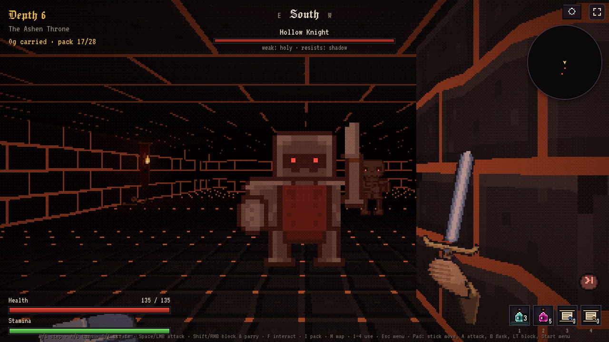

<p align="center">
  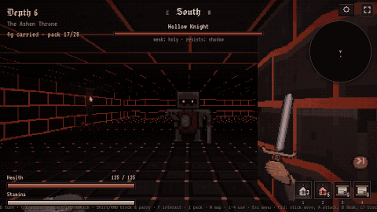
</p>

## The loop

1. **Prepare in Bleakmere.** Equip your best gear, fill the flask, buy supplies, take guild contracts, and check the market.
2. **Descend through six persistent floors.** Every run rolls its own dungeon from eight biomes, each with its own residents, and ends in the Ashen Throne. Explore vaults, secret rooms, shrines, altars, traps and treasure on the way to the Ashen King.
3. **Choose when to leave.** Go back up the stairs, kill the King and take his portal, or read a Scroll of Recall to open a two-way portal to town without ending the delve. If you die, you lose everything in your pack. Equipped gear stays with you.
4. **Make the haul count.** Sell into a shifting market, forge gear from what you found, deliver contracts, and spend renown on permanent Warden upgrades. Each finished delve advances the day, which moves prices, events, contracts and merchant stock.

## Biomes

Floors draw from a pool of biomes by depth, so no two runs take the same road down.

| | |
|---|---|
| 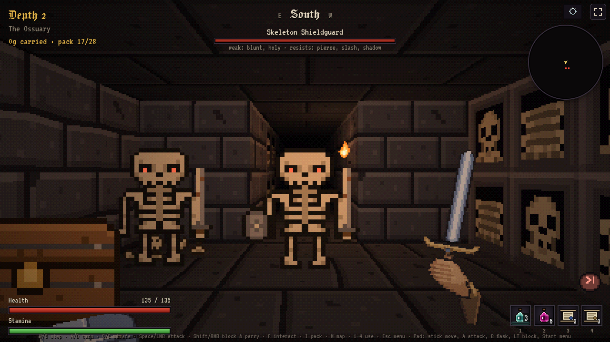 **The Ossuary** (depths 1–2): skull niches, shieldguards and archers | 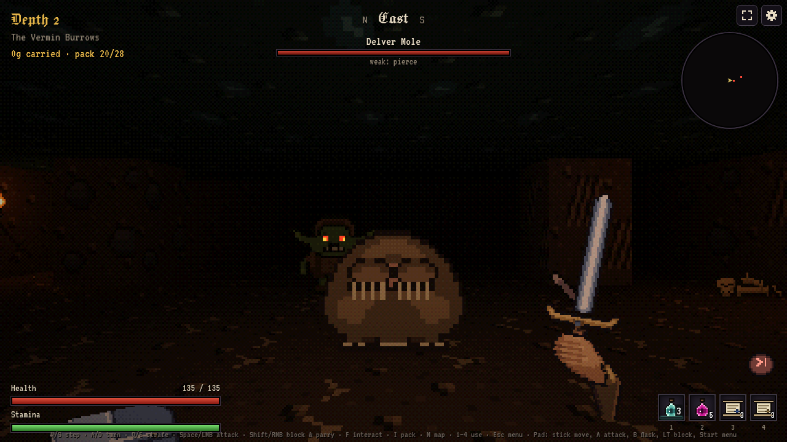 **The Vermin Burrows** (1–3): goblins, rats and Delver Moles that guard with their claws |
| 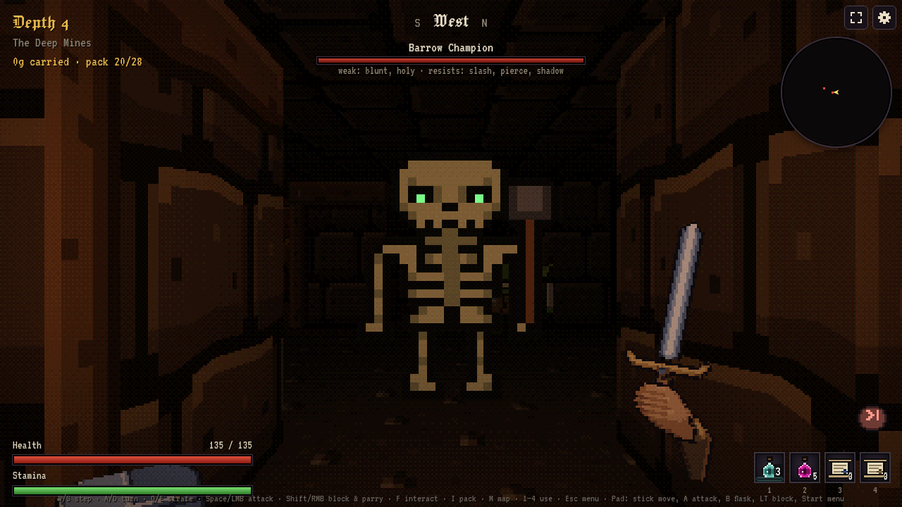 **The Deep Mines** (3–4): the Barrow Champion and goblin shieldbearers | 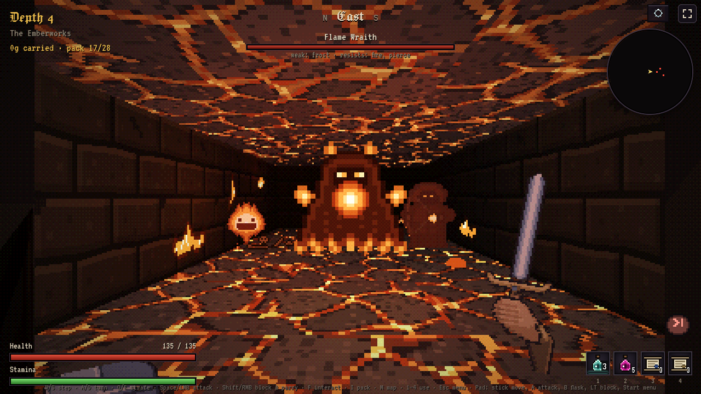 **The Emberworks** (3–5): molten floors, furnace grates, Flame Wraiths |
| 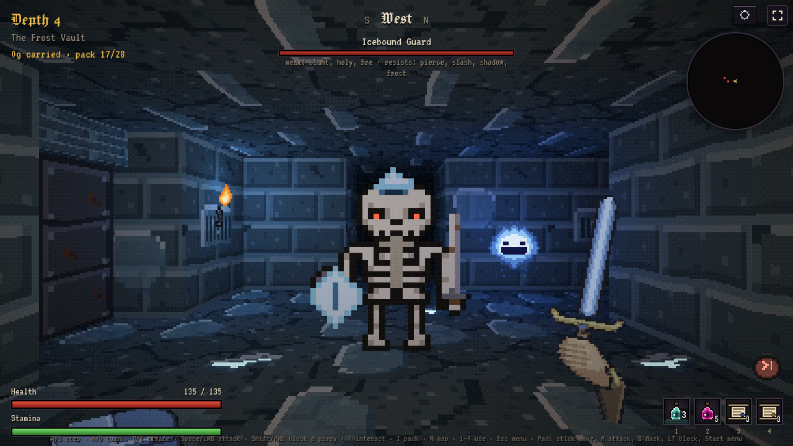 **The Frost Vault** (3–5): glazed ice, icicles, Icebound Guards and Frost Wisps | 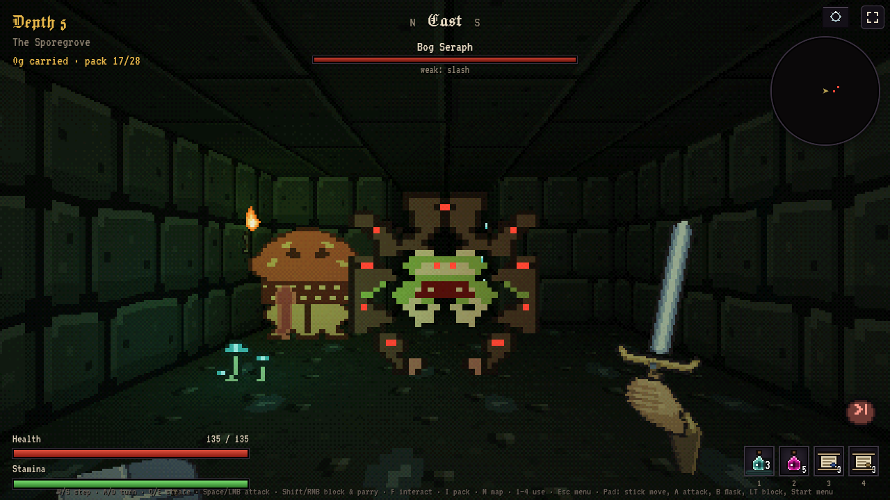 **The Sporegrove** (3–5): glowing fungus and the Bog Seraph, a champion-tier frog |

The Sunken Catacombs (1–3) run with shallow water. The Ashen Throne (6) waits at the bottom behind a fog gate that locks once you step through it.

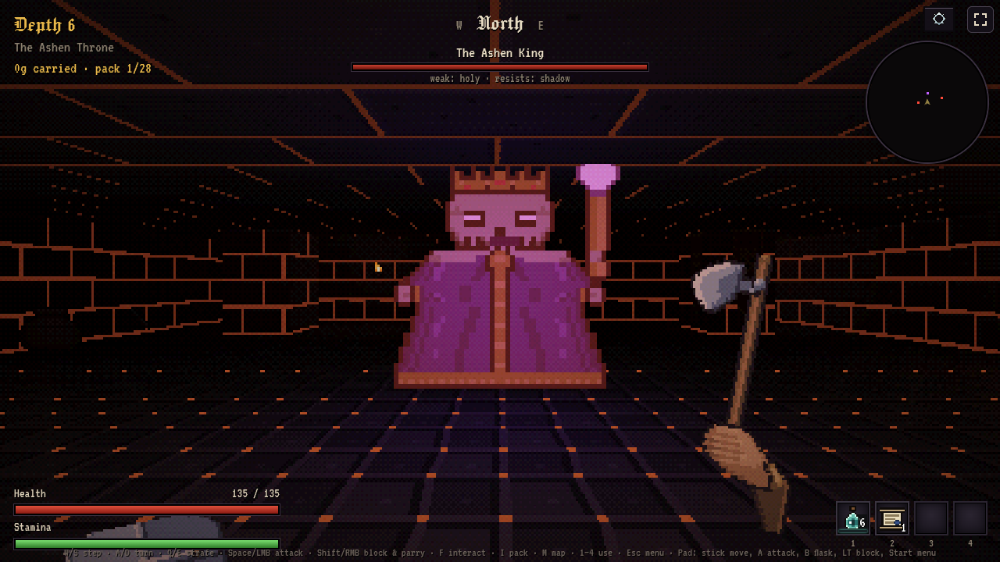

## What makes a delve interesting

- **Readable real-time fights.** Enemies lean in and flash red before they strike at your tile. Step away, block, or raise your guard at the last moment to parry. A parry leaves melee attackers reeling and taking double damage, and it sends arrows and bolts back the way they came. Stamina decides how hard you hit, and each enemy is weak or resistant to blunt, slash, pierce and elemental damage.
- **A real arsenal.** Daggers, swords, axes, maces, spears and a mining pick. Two-handers (Halberd, Great Maul, Greatsword) give up the shield to cleave the rank behind your target. Thrown belts of knives, axes or javelins sit beside your weapon: you pick up landed shafts or hold R to call them back. Five sigils, inscribed at the forge, add a spell to the mix.
- **Healing is a risk.** Your flask refills every delve, but each sip holds your guard down for half a second. Monsters drop food you eat where it falls, and rats will get to it first if you leave it. Flash and Backstep scrolls get you out of a bad wind-up or a bad position.
- **Loot with decisions attached.** Gear has a base, materials, a rarity and affixes, and better drops may need identifying first. Nine named relics carry effects with real tradeoffs, and the Ashen King always drops one you have not held yet. Some chests are mimics, and there is a tell if you look closely.
- **A dungeon worth searching.** Floors stay in place for the whole run, so you can backtrack. Vault keys lie on reachable ground, marked masonry hides secret rooms, and five kinds of shrine and altar trade blessings, curses, health, gold or a fight.
- **Wear, weight and timing.** Weapons, shields and armour wear with use and break for real. Space in your pack is limited, so every trip weighs spare gear and materials against the risk of one more floor.
- **A town that reacts.** Commodity prices drift, and selling a big stack pushes the price down. The forge lets you pick materials slot by slot. Metal adds defense, wood speed, hide health, cloth stamina and bone attack, and blueprints and salvage raise recipes to Rank 5.

| | |
|---|---|
| 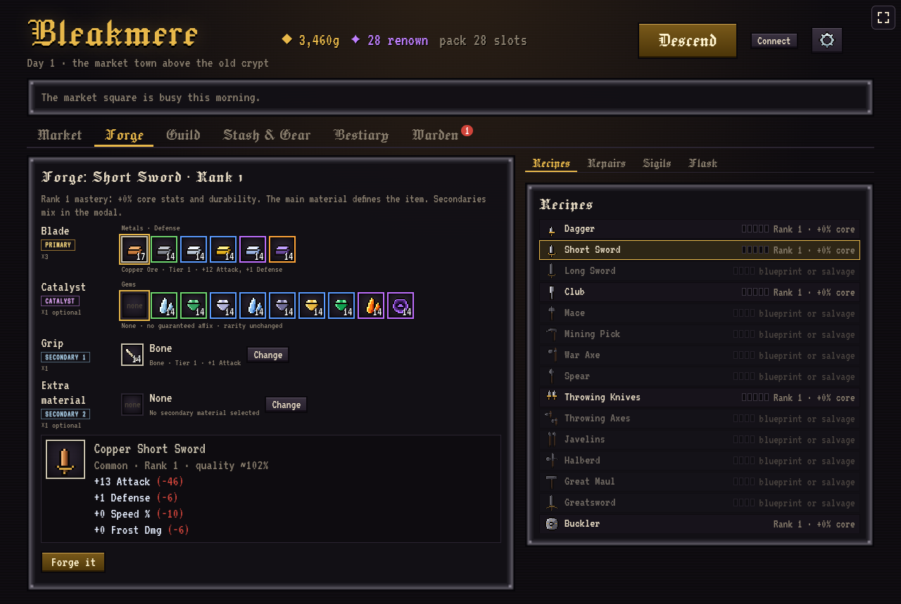 | 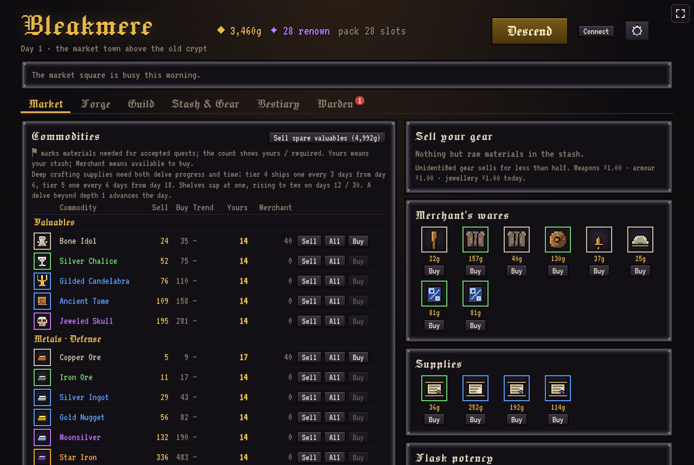 |
| 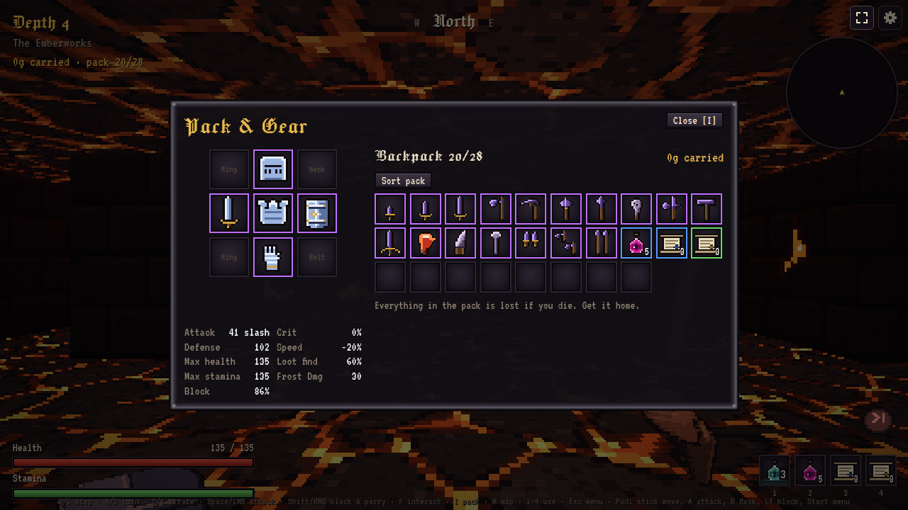 | 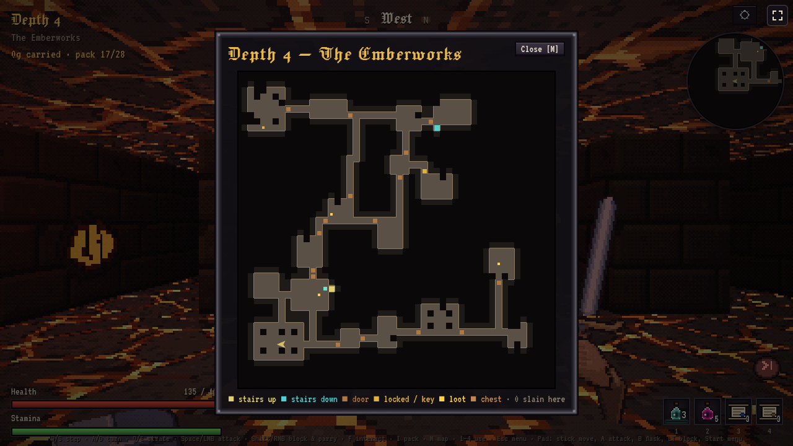 |

Pick **Normal** or **Hard** in Bleakmere. Progress saves locally in three named slots, and an optional passwordless email sign-in syncs saves across devices. When two devices disagree, you pick which save wins.

## Controls

| Key | Action |
|---|---|
| W / S | Step forward / back |
| A / D or ← / → | Turn |
| Q / E | Strafe |
| Space or left click | Attack |
| Shift or hold right click | Block; raise it as the blow lands to parry |
| F | Interact: open, search, loot, pray, push marked walls |
| T | Throw one shaft from your belt |
| R (hold) | Call thrown shafts back; release to stop |
| G / C | Cast your attuned sigil |
| 1–4 | Use the quick bar: flask, scrolls and other consumables (drag to reorder) |
| I / Tab | Pack and gear |
| M | Map (or click the minimap) |
| Esc | Pause and help |

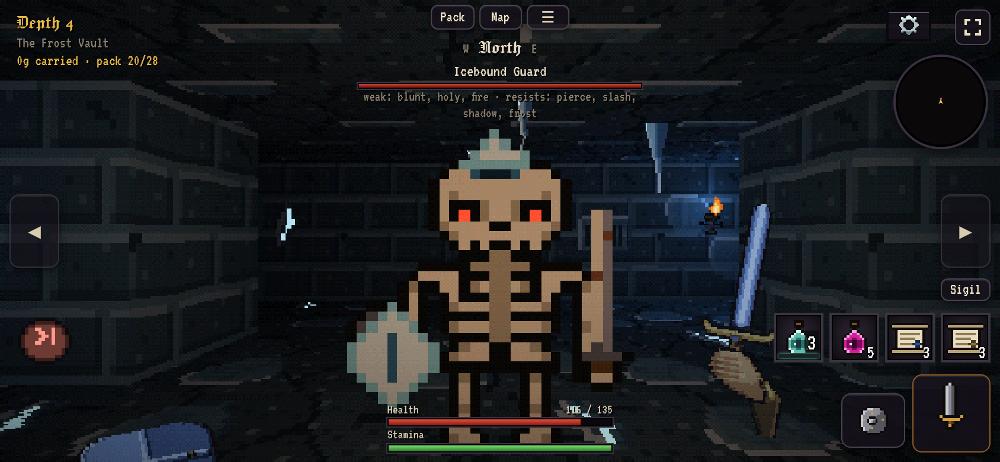

**Touch:** drag on the view to walk and turn. Tap the right half of the view or the main button to swing, loot or interact; tap or hold the left half (or the shield button) to block. Hold the ◀ ▶ buttons on the screen edges to strafe, or turn on tilt-to-strafe in Settings, where you can also swap what a sideways swipe does. The quick bar sits above attack and block. Throw, Call, Sigil, Pack and Map have their own buttons, and tapping the minimap opens the map too. Phones play in landscape only: where the browser allows it the screen locks sideways (an installed app on Android, or fullscreen, which the first tap turns on), and elsewhere, iPhone Safari included, turning the phone upright covers the game and pauses a delve. The corner button toggles fullscreen.

**Gamepad** (PC and mobile, Bluetooth or USB): the left stick steps and strafes, and the right stick or D-pad turns. A / RT swings or loots, X interacts, LT blocks and parries, LB throws, RB (hold) calls shafts back, Y casts the sigil, and B sips the flask. Select opens the pack, L3 the map, R3 uses the next quick-slot item, and Start pauses. In menus, A confirms and B goes back. Hits rumble where the browser supports it.

For exact rules and numbers, see the [mechanics reference](docs/MECHANICS.md).

## Contributing

```bash
git clone https://github.com/snowu/looting-simulator.git
cd looting-simulator
npm install
npm run dev   # http://localhost:5173/looting-simulator/
```

The game runs without any configuration. Cloud saves are optional and need a `.env`. See **[CONTRIBUTING.md](CONTRIBUTING.md)** for the full local setup, dev shortcuts (combat lab, boss arena, art sheets), tests and balance harnesses, the project layout, and the save-compatibility rules every change has to follow.
