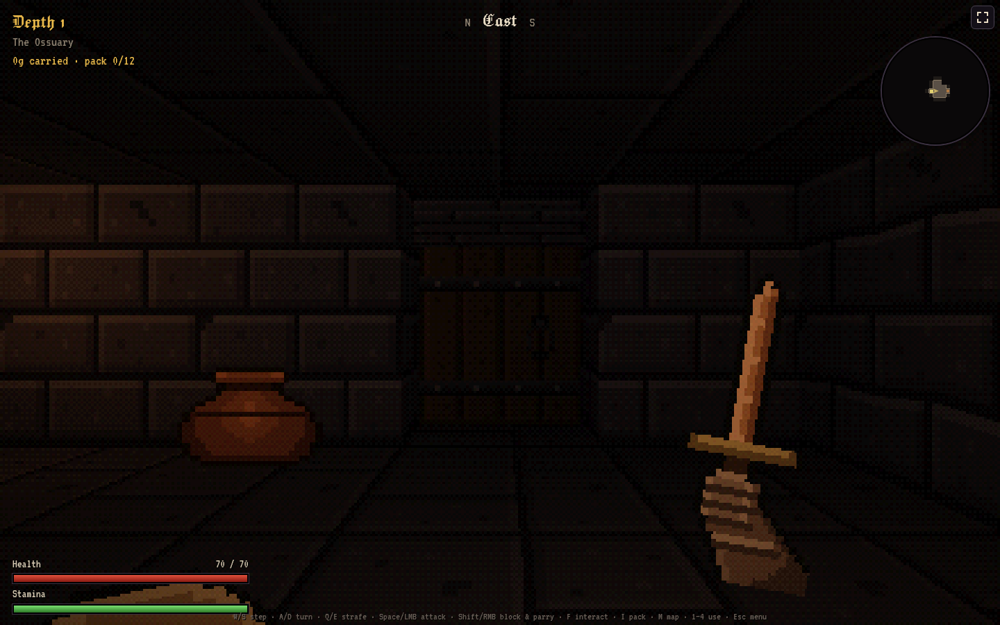
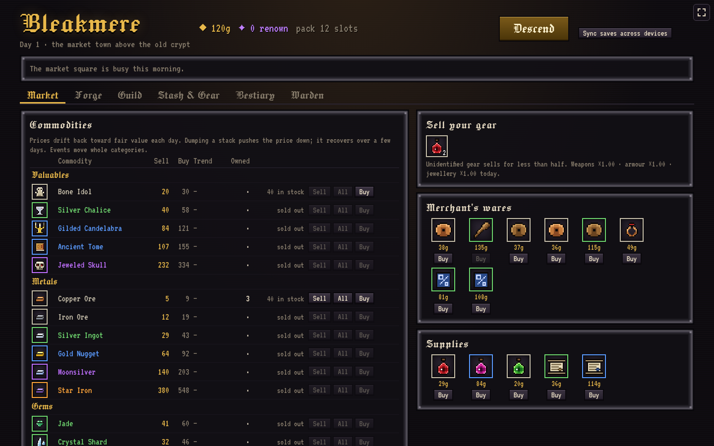

# Looting Simulator

A first-person, grid-step dungeon crawler about getting rich without getting killed. Delve beneath Bleakmere, haul out whatever you can carry, then decide whether to sell it, forge it into better gear, or save it for a guild contract. Inspired by **King's Field** and **Shadow Tower**, with a town economy that makes every trip home matter.

**[Play Looting Simulator on GitHub Pages](https://snowu.github.io/looting-simulator/)** — playable in a desktop or mobile browser.

## The loop

1. **Prepare in Bleakmere.** Equip your best gear, buy supplies, take contracts, and check the market.
2. **Descend through six persistent floors.** Each run has its own dungeon, from the Ossuary and Deep Mines through the Sunken Catacombs, Vermin Burrows, Frost Vault, Emberworks and Sporegrove to the Ashen Throne. Explore vaults, marked secret walls, shrines, traps, and treasure rooms on the way to the Ashen King.
3. **Choose when to leave.** Return by the stairs, defeat the King and use his portal, or open a Scroll of Recall for a round trip to town without ending the delve. Dying ends the run and costs everything in your pack; equipped gear stays with you.
4. **Make the haul count.** Sell into a changing market, craft with the materials you found, finish guild contracts, and spend renown on permanent upgrades. A completed delve advances the day, moving prices, events, contracts, and merchant stock.

## What makes a delve interesting

- **Readable, real-time fights.** Enemies telegraph attacks at your tile. Step away, block, or raise your guard at the last moment to parry. A parry staggers melee enemies and opens them to extra damage, or sends a projectile back down its path. Stamina affects how hard you hit, and damage types reward bringing the right weapon for the enemy.
- **Loot with decisions attached.** Equipment combines a base item, material, rarity, and affixes. Better drops may need identifying before you know what you found. Legendary finds are bespoke relics with distinct effects and tradeoffs, including gear that never dulls and armour that cuts all healing in half. The Ashen King guarantees a relic you have not held before.
- **A dungeon worth searching.** Floors remain in place for the whole run, so you can backtrack. Vault keys are hidden on reachable ground, faint masonry seals reveal secret rooms, and some chests reveal themselves as mimics only when you look closely.
- **Wear, weight, and timing.** Weapons, shields, and armour lose durability through use. Your pack has limited room, so a long run asks you to weigh spare gear, materials, consumables, and the risk of pushing one floor deeper.
- **A town that reacts.** Commodity prices fluctuate, selling a large stack pushes its price down, and events shift whole categories. Forge recipes let you choose materials for each component, while guild contracts give a purpose to particular finds and kills.

Progress saves locally in your browser. Passwordless sign-in lets you sync saves across devices.

## Controls

| Key | Action |
|---|---|
| W / S | Step forward / back |
| A / D or ← / → | Turn |
| Q / E | Strafe |
| Space or left click | Attack |
| Shift or hold right click | Block; time the raise to parry |
| F | Interact |
| T | Throw one shaft from your belt |
| R | Call every landed shaft back, one at a time |
| G / C | Cast your attuned sigil |
| 1–4 | Quick-use consumables |
| I / Tab | Pack and gear |
| M | Map |
| Esc | Pause and help |

On touchscreens, drag on the view to move and turn. Tap the view or the action button to attack or interact, and hold the shield button to block. The corner button offers fullscreen and landscape lock where supported.

Controllers (PC and mobile Bluetooth/USB pads) work through the Gamepad API — connect and press anything. Left stick steps and strafes, right stick / D-pad turns, A / RT swings (or loots when facing something), X interacts, LT blocks and parries, LB throws, RB calls shafts back, Y casts the sigil, Select opens the pack, L3 the map, R3 uses the next quick-slot item, Start pauses, and B closes. Menus and panels navigate with the stick / D-pad, A confirms, B goes back. Hits rumble where the browser supports it.

For exact rules and numbers, see the [mechanics reference](docs/MECHANICS.md). For development, run `npm install` and `npm run dev`; `npm test` and `npm run build` check the project.

Dev builds only, via the URL: `?autostart=1` skips the title, `?autostart=dungeon` drops straight into a run, `?autostart=boss` kits you out and stands you in the throne room facing the Ashen King, and `window.__game` exposes state. All of it is behind `import.meta.env.DEV`, so none of it reaches a production bundle.
