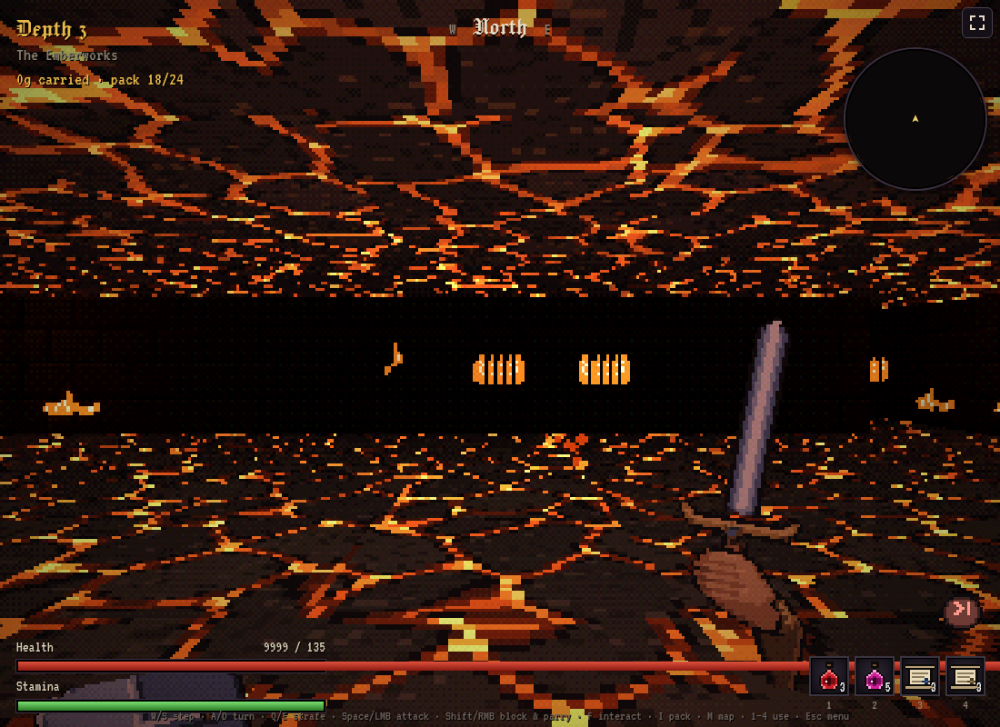
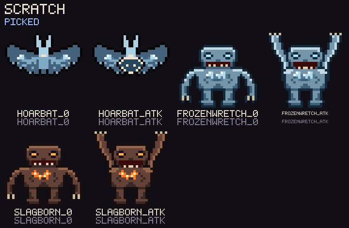
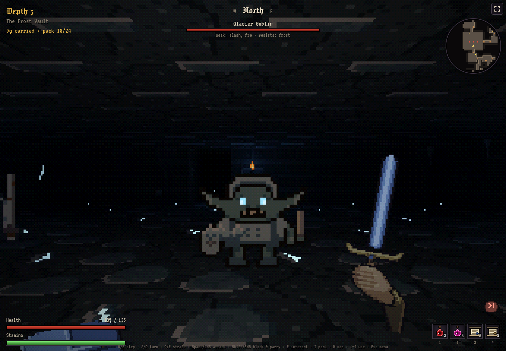
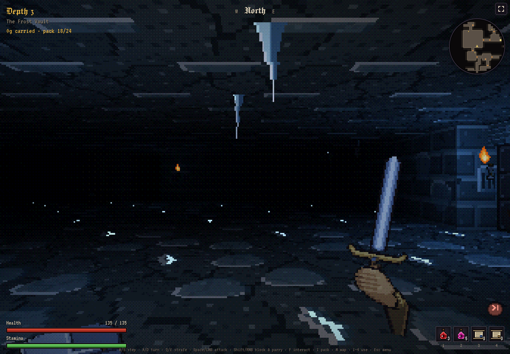
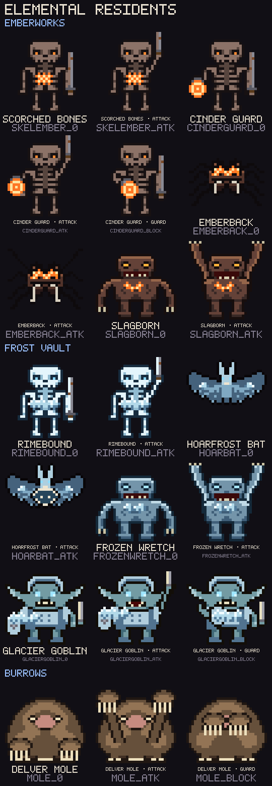
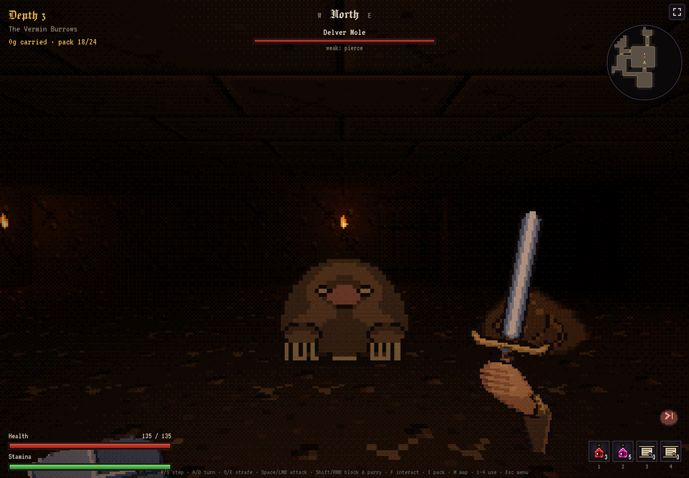

# Elemental biomes — review gallery

## Emberworks

Four walls place heat differently: unlit soot brick, an opened mortar joint,
a molten lower course, and an iron grille silhouetted against furnace light.
The unlit wall occupies two of five hash slots. Heat pulses out of phase between
surfaces and the room has a slower ambient pulse.

Floor and ceiling now each mix four broken-basalt layouts, with dry plates
above molten gaps and separate pulse rates. Ceiling beads swell and wobble
before detaching; floor bubbles occasionally burst into harmless lava droplets.

[Watch the lava drips and bursts](emberworks-lava.mp4)

The Hoarfrost Bat has small ridges along both wings. Frozen Wretch and Slagborn
chest details stay on their torsos when their arms rise.

## Frost Vault

Five walls: rimed brick, clear glaze, frozen cascade, deep split and ice-choked
grille. Two broken-rock floors carry translucent ice patches and sharp rims.
Most ice responds to the room lighting; only deep cracks emit light.

Three icicle silhouettes hang from a dedicated frozen roof in separated groups.
They are decoration: no collision, interaction, falling damage or point lights.

## Residents

Scorched Bones, Cinder Guard, Emberback and Slagborn inhabit the Emberworks.
Rimebound, Hoarfrost Bat, Frozen Wretch and Glacier Goblin inhabit the Frost
Vault. Each inherits its base creature's stats, timing and scaling, with changed
skin, elemental damage/resistances and one themed material drop.

The Delver Mole is a new Burrows resident. Its digging claws cover its face in
the guard pose and lift overhead before a blow. Flanking bypasses its frontal
protection. Root caches replace urns in newly generated Burrows floors.

[Full biome texture sheet](biomes.png) · [Full guard sheet](guard.png)

## How these previews were made

Art sheets use the same registered pixel art as the game. In-game captures use
headless Chromium and the normal renderer in a disposable dev-lab session.
The review rooms use depth-3 seeds 2 (Emberworks), 5 (Frost Vault), and 37
(Burrows). Enemies are staged and paused, room pillars cleared for the view,
extra ordinary sconces placed for visibility, and the dev log hidden. Icicle
positions come from floor generation. No saved playthrough was changed.
The GIF samples the real renderer, including existing torch flicker.

## Validation

- 477 tests pass, including inherited stats, spawn restrictions, neutral spawns,
  mole flanking, root-cache interaction, save round trips and icicle RNG isolation.
- Production build, typecheck and art-manifest validation pass.
- 56 scripted delves (8 per profile): no timeouts; all 8 prepared expeditions
  reach depth 6. This is a runtime and reachability check, not a balance retune.
- No JavaScript or WebGL errors reported during browser capture.

Existing saved floors keep their stored residents and props. New floors get the
new content. Tunnelling AI and falling/colliding icicles remain outside this pass.

## Lava and resident refinement validation

The new Emberworks capture uses a seed-2 depth-3 room in a disposable
lab session, with enemies/props removed and pillars cleared for the view. It
uses the normal game renderer and real-time effects; the animation is sampled.
The lava checks cover pool limits, pause, floor transitions, and unchanged floor data.
The resident sheet uses the registered idle/attack sprites, including PNGs
regenerated for the game. No player save was changed.
